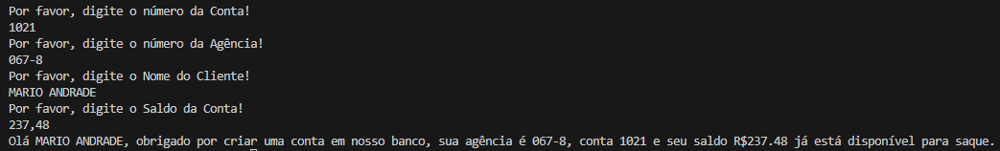

# Conta Bancaria usando java

## Descrição do Projeto

O projeto `ContaBanco` recebe dados via terminal contendo as características de conta em banco conforme atributos abaixo:
Dentro do projeto, a classe `ContaTerminal.java` realiza toda a codificação do nosso programa.

## Atributos da Conta

| Atributo    | Tipo    | Exemplo        |
| ----------- | ------- | -------------- |
| Numero      | Inteiro | 1021           |
| Agencia     | Texto   | 067-8          |
| Nome Cliente| Texto   | MARIO ANDRADE  |
| Saldo       | Decimal | 237.48         |

